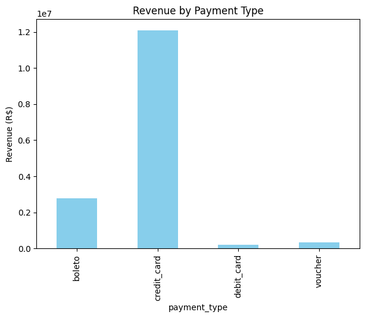
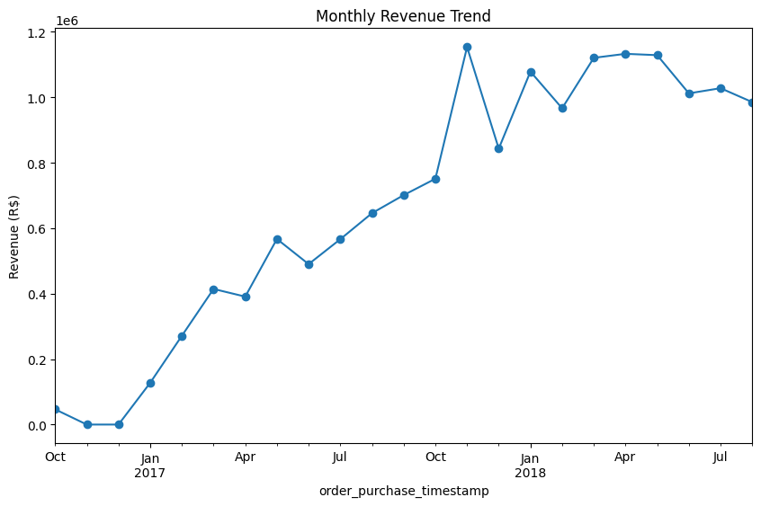
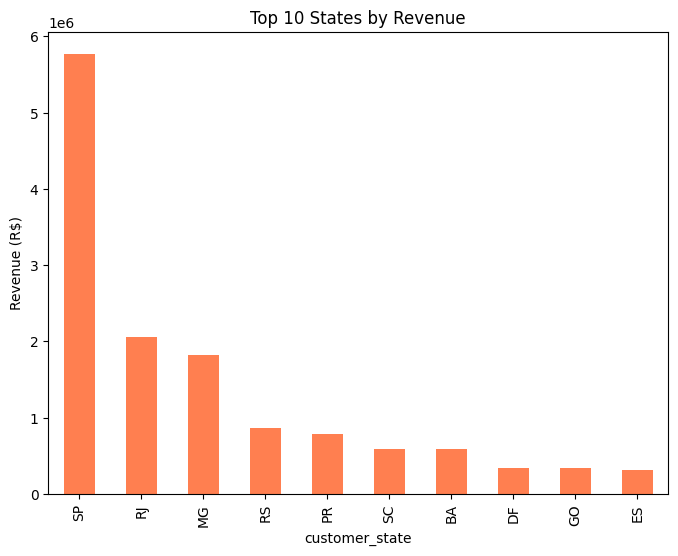
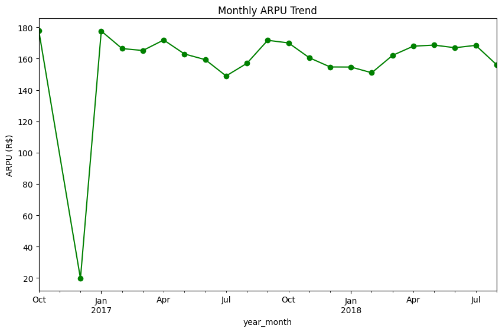

# E-commerce Monetization Analysis  

This project analyzes the **Olist E-commerce dataset** to uncover monetization insights.  
It focuses on revenue trends, payment types, and customer behavior to help understand how money flows in the marketplace.  

---

## 📂 Dataset  
The dataset comes from the Olist E-commerce platform, containing:  
- Orders  
- Payments  
- Customers  

We merged these datasets to build a **monetization view** (order, payment, customer info combined).  

---

## 📊 Key Metrics  

- **Total Revenue:** R$ 15,422,461.77  
- **Average Order Value (AOV):** R$ 159.86  
- **Average Revenue Per User (ARPU):** R$ 165.20  

### Revenue by Payment Type  
- Credit Card: R$ 12,101,094.88  
- Boleto: R$ 2,769,932.58  
- Voucher: R$ 343,013.19  
- Debit Card: R$ 208,421.12  

---

## 📈 Visualizations  

Here are some insights visualized:  


### 1. Revenue by Payment Type


### 2. Monthly Revenue Trend


### 3. Top 10 States by Revenue


### 4. Monthly ARPU Trend


---

## ⚙️ Tech Stack  

- Python (Pandas, Matplotlib, Seaborn)  
- Google Colab / Jupyter Notebook  
- GitHub for version control  

---

## 🚀 How to Run  

1. Clone this repo  
   ```bash
   git clone https://github.com/your-username/ecommerce-monetization-analysis.git
   cd ecommerce-monetization-analysis
